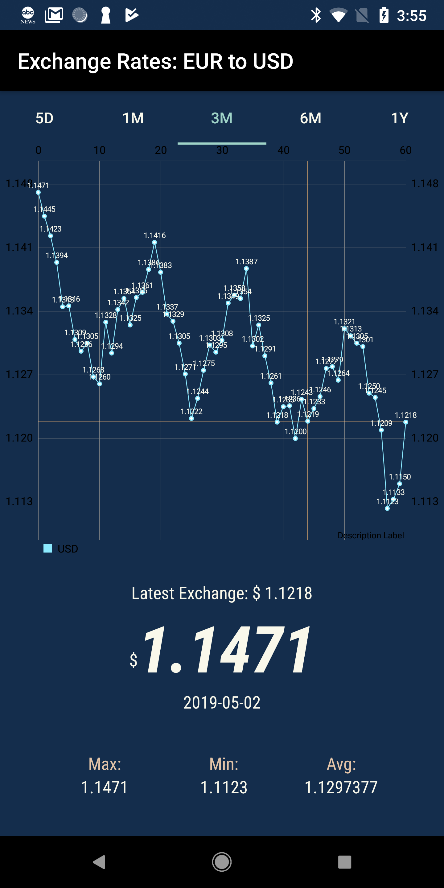
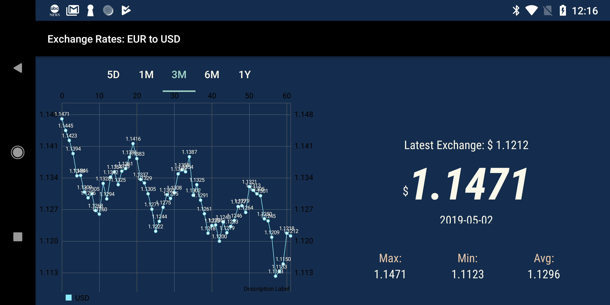

# Schibsted---Technical-Challenge

## Languages, libraries and tools used
- Kotlin
- Room
- Coroutines
- Android Architecture Components
- Koin
- Retrofit
- OkHttp
- Gson
- Mockito
- Kluent
- JUnit4
- MPAndroidChart

## Project Description
This app is retrieving data from a free API: https://api.exchangeratesapi.io and this one doesn't retrieve reliable data, which means that data could not be updated or the requested date may not return anything.
The project is using clean architecture with modules (app, domain and data).
1. The app module is using MVVM with live data.
2. The domain module has all the interactors (Use cases)
3. The data module is using the repository pattern to get data from UI and/or from db.

## Previsualization

|Portrait|Landscape|
|---|---|
|||

